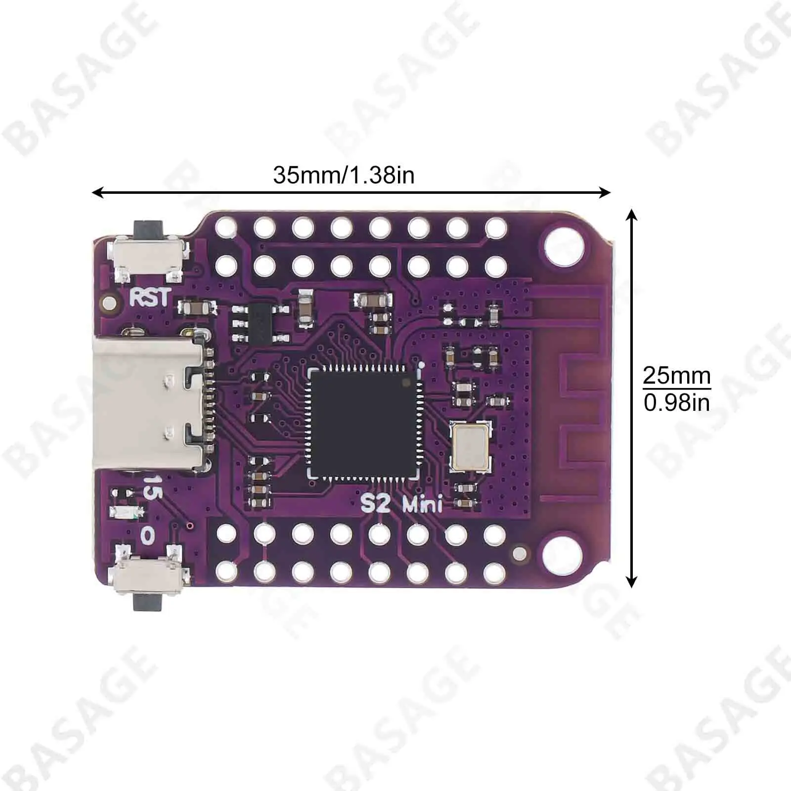
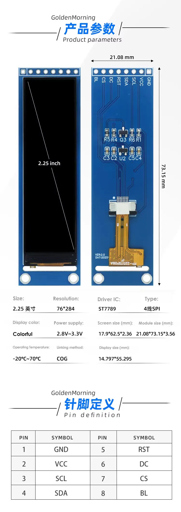
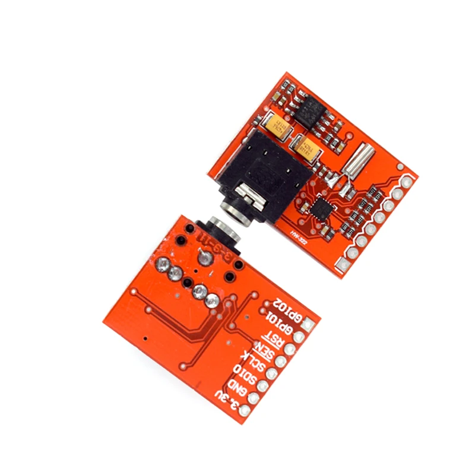
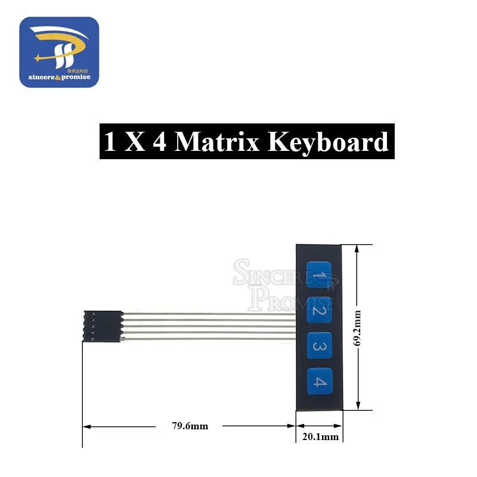
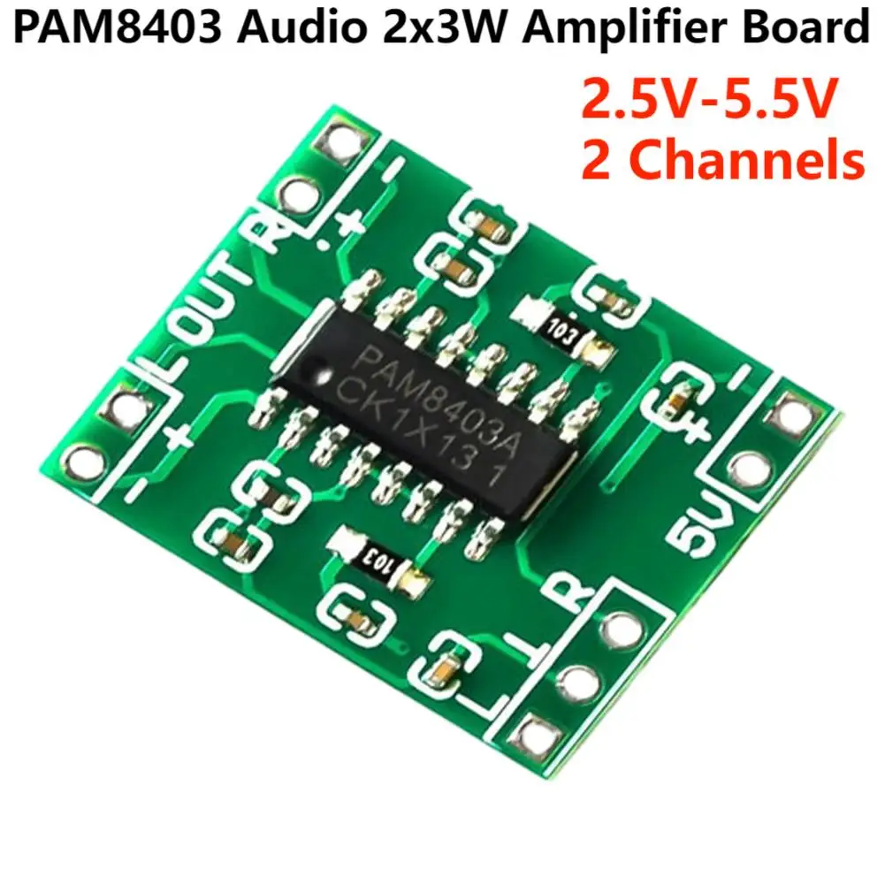
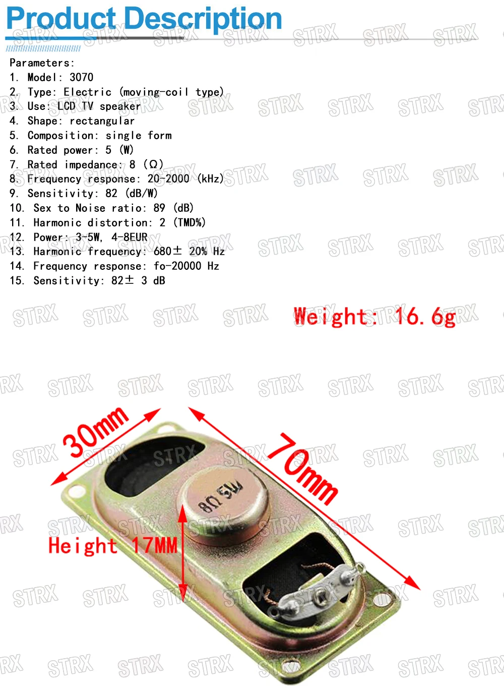

🌐 [Português](README.md) · **English**

# ESP32-S2 Mini — FM Radio (SI4703)

FM radio firmware for the **Lolin S2 Mini (ESP32-S2)** with a small
**76×284 px ST7789 LCD** used in landscape orientation (**284×76**).

The project includes a full graphical interface (7 screens) with navigation
through 4 physical buttons and control of a **SI4703** (FM + RDS) over I²C.
Memories and the last tuned frequency/volume are **stored in NVS** (they survive
a power-off).

> There is a `#define USE_SI4703` switch at the top of [src/main.cpp](src/main.cpp):
> `1` uses the real radio, `0` uses an in-RAM simulated model (handy for UI testing).

---

## Hardware

- **MCU:** Lolin S2 Mini (ESP32-S2FNR2, 4 MB Flash, 2 MB PSRAM)
- **Display:** TFT ST7789, **76×284 px** panel (offset inside the controller's 240×320 RAM)
- **Radio:** SI4703 (FM + RDS), over I²C
- **Input:** 4 physical buttons (below the display)
- **Audio:** PAM8403 amplifier (2×3 W) + 8 Ω / 3 W speaker

### Components

| Component | Image | Description |
|-----------|:-----:|-------------|
| **Lolin S2 Mini** |  | ESP32-S2 MCU (35×25 mm), 4 MB Flash + 2 MB PSRAM, native USB-C. |
| **ST7789 display** |  | 2.25" color TFT, 76×284 px, 4-wire SPI, 2.8–3.3 V supply. |
| **SI4703** |  | FM receiver with RDS over I²C; 3.5 mm jack that doubles as the antenna. |
| **1×4 keypad** |  | Membrane strip with 4 buttons (BT1–BT4) used for navigation. |
| **PAM8403 amplifier** |  | Class-D stereo amplifier 2×3 W, 2.5–5.5 V supply. |
| **Speaker** |  | Rectangular 8 Ω / 3 W speaker (70×30 mm) for audio output. |

---

## Pinout

### Display ST7789 (SPI)

| Signal | GPIO |
|--------|------|
| MOSI   | 35   |
| SCLK   | 36   |
| MISO   | 40   |
| CS     | 34   |
| DC     | 37   |
| RST    | 38   |

> The panel is 76×284 but the controller has 240×320 RAM. The image is drawn into
> a logical **284×76** sprite and copied to the panel window with **offset
> `OX=82, OY=18`** and a 90° rotation (see `show()` in [src/main.cpp](src/main.cpp)).
> Colors are inverted on this panel, hence `tft.invertDisplay(false)`.

### 1×4 membrane keypad

A single strip with **5 pins**: one **common (COM)** line plus the 4 keys. Each key
ties its line to COM. The COM line is held **LOW** by a GPIO and each key is read
with `INPUT_PULLUP` (press → pin goes LOW). Alternatively, COM may go straight to **GND**.

| Signal    | GPIO |
|-----------|------|
| COM (LOW) | 5    |
| Key 1     | 1    |
| Key 2     | 2    |
| Key 3     | 3    |
| Key 4     | 4    |

### SI4703 — FM/RDS (I²C)

| Signal     | GPIO |
|------------|------|
| SDA / SDIO | 8    |
| SCL / SCLK | 9    |
| RST        | 7    |

> The SI4703 requires a specific reset sequence (SDIO held LOW during the RST
> rising edge, to select the 2-wire I²C mode). This is done **manually** in
> `setup()` *before* `Wire.begin()`, so the library doesn't repeat the reset and
> grab the SDA pin again. The [`mathertel/Radio`](https://github.com/mathertel/Radio)
> library is used (SI4703 + RDS). The module needs **pull-ups** (~4.7 kΩ) on
> SDA/SCL — most boards already include them.

### Wiring diagram

```text
                          ┌───────────────────────────┐
                          │      Lolin S2 Mini         │
                          │        (ESP32-S2)          │
                          │                            │
   ┌──────────────┐       │                            │       ┌──────────────┐
   │  TFT ST7789  │       │                            │       │   SI4703 FM  │
   │   76 x 284   │       │                            │       │   (I2C/RDS)  │
   │              │       │                            │       │              │
   │  MOSI/SDA ───┼───────┤ 35                       8 ├───────┼─ SDIO (SDA)  │
   │  SCLK     ───┼───────┤ 36                       9 ├───────┼─ SCLK (SCL)  │
   │  MISO     ───┼───────┤ 40                       7 ├───────┼─ RST         │
   │  CS       ───┼───────┤ 34                         │       │  GND ── GND  │
   │  DC       ───┼───────┤ 37                  3V3 ───┼───────┼─ VCC (3V3)   │
   │  RST      ───┼───────┤ 38                         │       │  ANT ── wire │
   │  VCC ── 3V3  │       │                            │       └──────────────┘
   │  GND ── GND  │       │   1    2    3    4    5     │
   │  BLK ── 3V3  │       │   │    │    │    │    │     │
   └──────────────┘       └───┼────┼────┼────┼────┼────┘
                              │    │    │    │    │ COM (LOW)
                            ┌─┴────┴────┴────┴────┴─┐
                            │  [1] [2] [3] [4]  COM │  1x4 membrane keypad
                            └───────────────────────┘  (5 pins: COM + 4 keys)
                                each key ties its line to COM
                                COM held LOW (GPIO5) — press pulls the GPIO LOW
```

> **Note:** the LCD uses `MOSI` (SPI data line) and the SI4703 uses `SDIO`
> (I²C data) — they are **independent** buses, even though on the radio board the
> pin is labelled "SDA".

### Power and battery reading (LiPo)

Power is reused from a **small powerbank** (1S LiPo cell + board with a TP4056-style
charger and a 5 V boost converter). The powerbank's **5 V** USB output feeds the
Lolin S2 Mini (`5V` pin) and **GND** is shared. To show the charge on screen, the
**cell** voltage (`B+`, 3.0–4.2 V) is read with the ADC.

Since the ESP32-S2 ADC only accepts up to ~3.3 V, a **1:2 resistor divider**
(R1 = R2 = 100 kΩ) halves the voltage: 4.2 V → 2.1 V (within range). The firmware
reads **GPIO6** (ADC1) and multiplies by 2.

```text
   Powerbank (1S LiPo cell, 3.7 V nominal)
   ┌───────────────────────────────────────┐
   │  powerbank board                       │
   │   ┌── B+ (cell, 3.0–4.2V) ─────────────┼──► to the divider (below)
   │   │                                     │
   │   ├── 5V USB output ──────────────────┼──► 5V  of the Lolin S2 Mini
   │   └── B- / GND ──────────────────────┬─┼──► GND of the Lolin S2 Mini (shared)
   └──────────────────────────────────────┼─┘
                                           │
   1:2 divider (charge reading):          │
                                          GND
        B+ ──[ R1 100kΩ ]──┬──[ R2 100kΩ ]── GND
                           │
                           ├───────────────── GPIO6 (ADC1)   Vadc = Vbat / 2
                           │
                         ──┴── C1 100nF (optional, noise filter)
                           │
                          GND
```

> - **Shared GND is mandatory** between the powerbank and the ESP32, otherwise the
>   reading has no reference.
> - With R1 = R2 = 100 kΩ the divider draws ~21 µA (negligible).
> - Tapping `B+` means opening the powerbank — **mind the polarity**.
> - Many small powerbanks **shut the boost off** under low load (< ~50 mA); if that
>   happens, keep the load up or use an always-on model.
> - The percentage is a piecewise estimate of the 1S discharge curve; everything can
>   be disabled with `#define USE_BATTERY 0` in [src/main.cpp](src/main.cpp).

---

## Screens

1. **Splash** — animated boot banner (antenna with radio waves + equalizer).
2. **Main** — current station/frequency:
   - **No RDS:** centered frequency and the volume (`VOL x`) on the top right.
   - **With RDS:** large station name, small frequency on the top right, and
     scrolling *radiotext*. The volume shows at the top center and, when the
     frequency is a stored memory, shows `P0X` before the frequency.
3. **Tune** — manual frequency tuning, with configurable step (0.10 / 0.05,
   toggled with a **long press on button 2**). Shows the RDS station name at the
   top (when available).
4. **Volume** — level 0–30, with mute.
5. **Presets** — stored memories (up to 20, in pages of 4). Empty by default.
   On open, the memory of the current frequency is already selected (if any).
6. **Scan** — automatic search with **auto-store** (see below).
7. **Menu** — Radio / Presets / Volume / Scan / About.
8. **Message** — confirmations (e.g. "Station saved"), auto-dismiss after 2.5 s.

The bottom bar of each screen shows the function of the 4 buttons; **the 3D
buttons are physical** (below the display) and are not part of the drawing.

---

## Radio and memories

- **RDS:** the station name (PS) and *radiotext* are read from the SI4703.
  `checkRDS()` runs every loop iteration so no groups are missed. With no RDS, the
  main screen shows just the centered frequency.
- **Memories:** up to **20**, empty by default. Stored in **NVS** (`Preferences`,
  namespace `fmradio`) — they survive a power-off.
- **Scan (auto-store):** reached via **Menu → Scan**. The screen opens **idle**;
  the search only starts when you press **button 1**. On start it **clears all
  memories**, starts at the **band bottom** (87.5 MHz) and sweeps up with `seekUp`.
  At each station it only stores if there is **stereo + a stable RDS name** (the
  name must stay the same for ~1.5 s; waits up to 7 s per station). It ends when it
  wraps around the band or reaches 20 memories.
- **Restore on boot:** the last **frequency, volume and mute** are written to NVS
  (with a 2 s deferred write to spare the flash) and restored at startup.

---

## Navigation

**Global shortcuts (long press ≈ 700 ms):**

| Button (long) | Action            |
|---------------|-------------------|
| 1             | → Tune            |
| 4             | → Menu            |

**Short presses per screen:**

| Screen  | 1            | 2        | 3            | 4            |
|---------|--------------|----------|--------------|--------------|
| Main    | freq −       | freq +   | → Volume     | → Presets    |
| Volume  | vol −        | vol +    | Mute         | OK → Main    |
| Tune    | freq −       | freq +   | Save memory  | Exit         |
| Presets | previous     | next     | OK (tune)¹   | Exit         |
| Scan    | Start / Stop | —        | —            | Exit         |
| Menu    | ◄            | ►        | OK (enter)   | Exit         |
| Message | dismiss      | —        | —            | —            |

> In **Tune**, the step (0.10 / 0.05) is toggled with a **long press on button 2**.
>
> ¹ In **Presets**, a **long press on button 3** deletes the selected memory.

**Inactivity timeout:** on any screen other than Main, after **30 s** with no
interaction it returns to Main (except while scanning).

---

## Testing over Serial

To test navigation without pressing the physical buttons, use the **Serial
Monitor** (115200 baud):

| Key             | Equivalent                  |
|-----------------|-----------------------------|
| `1` `2` `3` `4` | short press of buttons 1–4  |
| `q` `w` `e` `r` | long press of buttons 1–4   |

---

## Build & Upload (PlatformIO)

```bash
pio run            # build
pio run -t upload  # flash (COM port set in platformio.ini)
pio device monitor # serial console
```

Relevant configuration in [platformio.ini](platformio.ini):

- `board = lolin_s2_mini`, `framework = arduino`
- `ARDUINO_USB_CDC_ON_BOOT=1` (Serial over native USB CDC)
- TFT_eSPI configured via `build_flags` (ST7789 driver, pins, fonts, RGB BGR)
- Loaded fonts: GLCD, 2, 4, 6, 7, GFXFF (FreeSans used for the *radiotext*)

---

## Structure

```text
ESP32S2Mini_FMRadio/
├── platformio.ini      # board + TFT_eSPI configuration (build_flags)
├── src/
│   └── main.cpp        # UI, state machine, SI4703 and persistence (NVS)
├── README.md           # Portuguese
└── README.en.md        # English
```

---

## Next steps

- [x] Wire the SI4703 and enable the real calls.
- [x] Read real RDS (station name + radiotext) from the SI4703.
- [x] Persist memories and last frequency/volume in NVS (flash).
- [x] Individual removal of memories (long press on button 3 in Presets).
- [x] LiPo battery level indicator (ADC + 1:2 divider — see schematic above).
- [ ] Validate the 4 physical buttons on the final hardware
      (the firmware already logs every press over Serial to help with this check).
