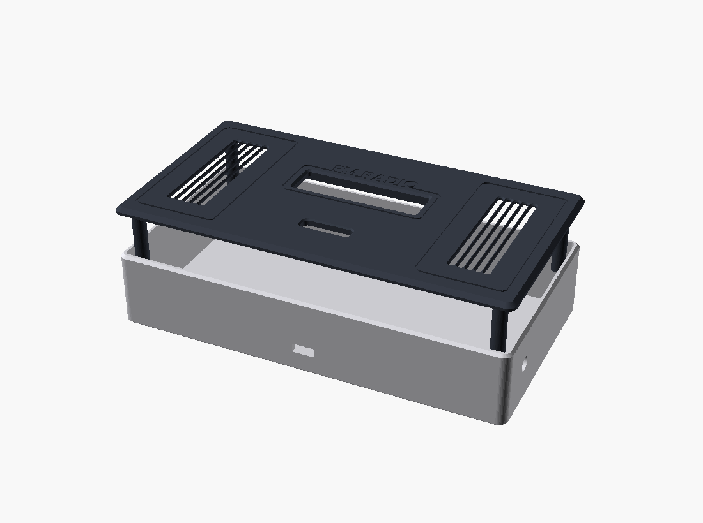

🌐 **Português** · [English](README.en.md)

# ESP32-S2 Mini — Rádio FM (SI4703)

Firmware de um rádio FM para **Lolin S2 Mini (ESP32-S2)** com um pequeno LCD
**ST7789 de 76×284 px** usado em orientação paisagem (**284×76**).

O projeto inclui uma interface gráfica completa (7 ecrãs) com navegação por
4 botões físicos e controlo de um **SI4703** (FM + RDS) por I²C. As memórias e a
última sintonia/volume são **guardadas em NVS** (sobrevivem a desligar).

> Existe um interruptor `#define USE_SI4703` no topo de [src/main.cpp](src/main.cpp):
> a `1` usa o rádio real, a `0` usa um modelo simulado em RAM (útil para testar a UI).

---

## Hardware

- **MCU:** Lolin S2 Mini (ESP32-S2FNR2, 4 MB Flash, 2 MB PSRAM)
- **Display:** TFT ST7789, painel de **76×284 px** (offset dentro da RAM 240×320 do controlador)
- **Rádio:** SI4703 (FM + RDS), via I²C
- **Entrada:** 4 botões físicos (por baixo do display)
- **Áudio:** amplificador PAM8403 (2×3 W) + altifalante 8 Ω / 3 W

### Componentes

| Componente | Imagem | Descrição |
|------------|:------:|-----------|
| **Lolin S2 Mini** |  | MCU ESP32-S2 (35×25 mm), 4 MB Flash + 2 MB PSRAM, USB-C nativo. |
| **Display ST7789** |  | TFT 2.25" a cores, 76×284 px, interface SPI de 4 fios, alimentação 2.8–3.3 V. |
| **SI4703** |  | Recetor FM com RDS por I²C; jack de 3.5 mm que serve também de antena. |
| **Teclado 1×4** |  | Membrana com 4 botões (BT1–BT4) usada para a navegação. |
| **Amplificador PAM8403** |  | Amplificador classe-D estéreo 2×3 W, alimentação 2.5–5.5 V. |
| **Altifalante** |  | Altifalante retangular 8 Ω / 3 W (70×30 mm) para a saída de áudio. |

---

## Pinout

### Display ST7789 (SPI)

| Sinal | GPIO |
|-------|------|
| MOSI  | 35   |
| SCLK  | 36   |
| MISO  | 40   |
| CS    | 34   |
| DC    | 37   |
| RST   | 38   |

> O painel é de 76×284 mas o controlador tem RAM de 240×320. A imagem é desenhada
> num *sprite* lógico de **284×76** e copiada para a janela do painel com **offset
> `OX=82, OY=18`** e rotação de 90° (ver `show()` em [src/main.cpp](src/main.cpp)).
> As cores estão invertidas no painel, por isso é usado `tft.invertDisplay(false)`.

### Teclado de membrana 1×4

Tira única com **5 pinos**: uma linha **comum (COM)** mais as 4 teclas. Cada tecla
liga a sua linha ao COM. O COM é mantido a **LOW** por um GPIO e cada tecla é lida
com `INPUT_PULLUP` (premir → pino a LOW). Em alternativa, o COM pode ir direto a **GND**.

| Sinal     | GPIO |
|-----------|------|
| COM (LOW) | 5    |
| Tecla 1   | 1    |
| Tecla 2   | 2    |
| Tecla 3   | 3    |
| Tecla 4   | 4    |

### SI4703 — FM/RDS (I²C)

| Sinal      | GPIO |
|------------|------|
| SDA / SDIO | 8    |
| SCL / SCLK | 9    |
| RST        | 7    |

> O SI4703 requer uma sequência de reset específica (SDIO a LOW durante o flanco
> de subida do RST, para selecionar o modo I²C de 2 fios). Isto é feito
> **manualmente** no `setup()` *antes* do `Wire.begin()`, para a biblioteca não
> repetir o reset e voltar a ocupar o pino SDA. Usa-se a
> [`mathertel/Radio`](https://github.com/mathertel/Radio) (SI4703 + RDS).
> O módulo precisa de **pull-ups** (~4.7 kΩ) em SDA/SCL — a maioria das placas já os traz.

### Diagrama de ligações

```
                          ┌───────────────────────────┐
                          │      Lolin S2 Mini         │
                          │        (ESP32-S2)          │
                          │                            │
   ┌──────────────┐       │                            │       ┌──────────────┐
   │  TFT ST7789  │       │                            │       │   SI4703 FM  │
   │   76 x 284   │       │                            │       │   (I2C/RDS)  │
   │              │       │                            │       │              │
   │  MOSI/SDA ───┼───────┤ 35                       8 ├───────┼─ SDIO (SDA)  │
   │  SCLK     ───┼───────┤ 36                       9 ├───────┼─ SCLK (SCL)  │
   │  MISO     ───┼───────┤ 40                       7 ├───────┼─ RST         │
   │  CS       ───┼───────┤ 34                         │       │  GND ── GND  │
   │  DC       ───┼───────┤ 37                  3V3 ───┼───────┼─ VCC (3V3)   │
   │  RST      ───┼───────┤ 38                         │       │  ANT ── fio  │
   │  VCC ── 3V3  │       │                            │       └──────────────┘
   │  GND ── GND  │       │   1    2    3    4    5     │
   │  BLK ── 3V3  │       │   │    │    │    │    │     │
   └──────────────┘       └───┼────┼────┼────┼────┼────┘
                              │    │    │    │    │ COM (LOW)
                            ┌─┴────┴────┴────┴────┴─┐
                            │  [1] [2] [3] [4]  COM │  Teclado membrana 1x4
                            └───────────────────────┘  (5 pinos: COM + 4 teclas)
                                cada tecla liga a sua linha ao COM
                                COM a LOW (GPIO5) — premir leva o GPIO a LOW

   Botoes: GPIO 1/2/3/4  →  botao  →  GND   (sem resistencia externa)
```

> **Nota:** o LCD usa `MOSI` (linha de dados SPI) e o SI4703 usa `SDIO` (dados I²C) —
> são barramentos **independentes**, apesar de na placa rádio o pino se chamar "SDA".

### Alimentação e leitura da bateria (LiPo)

A alimentação é reaproveitada de uma **pequena powerbank** (célula LiPo 1S +
placa com carregador tipo TP4056 e *boost* para 5 V). A saída **5 V** USB da
powerbank alimenta o Lolin S2 Mini (pino `5V`) e o **GND** é comum. Para mostrar
a carga no ecrã, lê-se a tensão da **célula** (`B+`, 3.0–4.2 V) com o ADC.

Como o ADC do ESP32-S2 só aceita até ~3.3 V, usa-se um **divisor resistivo 1:2**
(R1 = R2 = 100 kΩ) que reduz a tensão a metade: 4.2 V → 2.1 V (dentro da escala).
O firmware lê em **GPIO6** (ADC1) e multiplica por 2.

```
   Powerbank (célula LiPo 1S, 3.7 V nominal)
   ┌───────────────────────────────────────┐
   │  placa do powerbank                    │
   │   ┌── B+ (célula, 3.0–4.2V) ───────────┼──► para o divisor (abaixo)
   │   │                                     │
   │   ├── saída USB 5V ────────────────────┼──► 5V  do Lolin S2 Mini
   │   └── B- / GND ──────────────────────┬─┼──► GND do Lolin S2 Mini (comum)
   └──────────────────────────────────────┼─┘
                                           │
   Divisor 1:2 (leitura da carga):        │
                                          GND
        B+ ──[ R1 100kΩ ]──┬──[ R2 100kΩ ]── GND
                           │
                           ├───────────────── GPIO6 (ADC1)   Vadc = Vbat / 2
                           │
                         ──┴── C1 100nF (opcional, filtra ruído)
                           │
                          GND
```

> - **GND comum obrigatório** entre a powerbank e o ESP32, senão a leitura não tem
>   referência.
> - Com R1 = R2 = 100 kΩ o consumo do divisor é ~21 µA (desprezável).
> - Ligar o `B+` exige abrir a powerbank — **respeitar a polaridade**.
> - Muitas powerbanks pequenas **desligam o boost** com consumos baixos (< ~50 mA);
>   se isso acontecer, mantém-se a carga ligada por outro meio ou usa-se uma com
>   *always-on*.
> - A percentagem é uma estimativa por troços da curva de descarga 1S; podes
>   desligar tudo com `#define USE_BATTERY 0` em [src/main.cpp](src/main.cpp).

---

## Caixa 3D (impressão)

Caixa modelada em **OpenSCAD**, em duas peças (corpo + frente), pensada para
**imprimir sem suportes**. A frente tem o recorte do LCD, duas grelhas de
altifalante em ranhuras verticais, a fenda para a fita do teclado de membrana e a
etiqueta "FM RADIO" gravada. O fecho é por **4 postes** com parafusos **M3** pela
traseira.

| Vista frontal | Vista isométrica |
|:-------------:|:----------------:|
|  |  |

- **Dimensões exteriores:** ≈ **163 × 93 × 37 mm** (L × A × P).
- **Paredes / base / frente:** 2.4 / 2.4 / 3.0 mm; cantos arredondados e bordos
  chanfrados a 45°.
- **Aberturas laterais:** USB-C e jack de antena.

### Ficheiros ([docs/](docs/))

| Ficheiro | Conteúdo |
|----------|----------|
| [docs/fmradio_case.scad](docs/fmradio_case.scad) | Fonte paramétrica (OpenSCAD). |
| [docs/body.stl](docs/body.stl) | Corpo, pronto a fatiar. |
| [docs/faceplate.stl](docs/faceplate.stl) | Frente, pronta a fatiar. |

### Orientação de impressão

- **faceplate:** face exterior (lisa) **para baixo**; os postes apontam para cima.
- **body:** abertura **para cima**.

### Regerar os STL a partir do `.scad`

```bash
openscad -D 'part="body"'      -o docs/body.stl      docs/fmradio_case.scad
openscad -D 'part="faceplate"' -o docs/faceplate.stl docs/fmradio_case.scad
```

> Os parâmetros (paredes, recortes do LCD/altifalantes, postes, etc.) estão no topo
> de [docs/fmradio_case.scad](docs/fmradio_case.scad) e podem ser ajustados.

---

## Ecrãs

1. **Splash** — banner animado de arranque (antena com ondas de rádio + equalizador).
2. **Principal** — estação/frequência a tocar:
   - **Sem RDS:** a frequência centrada e o volume (`VOL x`) no topo direito.
   - **Com RDS:** nome da estação em grande, frequência pequena no topo direito e
     *radiotext* com scroll horizontal. O volume aparece no topo ao centro e,
     quando a frequência é uma memória, mostra `P0X` antes da frequência.
3. **Sintonia (Tune)** — ajuste manual da frequência, com passo configurável
   (0.10 / 0.05, alternado com o **clique longo no botão 2**). Mostra o nome da
   estação RDS no topo (quando disponível).
4. **Volume** — nível 0–30, com *mute*.
5. **Presets** — memórias guardadas (até 20, em páginas de 4). Vazio por defeito.
   Ao abrir, fica já selecionada a memória da frequência atual (se houver).
6. **Scan** — procura automática com **auto-store** (ver abaixo).
7. **Menu** — Rádio / Presets / Volume / Scan / Sobre.
8. **Mensagem** — confirmações (ex.: "Estação guardada"), auto-fecho em 2,5 s.

A barra inferior de cada ecrã mostra as funções dos 4 botões; **os botões 3D são
físicos** (por baixo do display) e não fazem parte do desenho.

---

## Rádio e memórias

- **RDS:** o nome da estação (PS) e o *radiotext* são lidos do SI4703. O
  `checkRDS()` corre a cada iteração do loop para não perder grupos. Sem RDS, o
  ecrã principal mostra apenas a frequência centrada.
- **Memórias:** até **20**, vazias por defeito. Guardadas em **NVS** (`Preferences`,
  namespace `fmradio`) — sobrevivem a desligar.
- **Scan (auto-store):** acede-se pelo **Menu → Scan**. O ecrã abre **em espera**;
  a procura só arranca ao premir o **botão 1**. Ao iniciar **apaga todas as
  memórias**, começa no **início da banda** (87.5 MHz) e percorre-a com `seekUp`.
  Em cada estação, só guarda se houver **estéreo + nome RDS estável** (o nome tem
  de se manter igual ~1,5 s; espera até 7 s por estação). Termina ao dar a volta à
  banda ou ao atingir 20 memórias.
- **Restauro ao ligar:** a última **frequência, volume e mute** são gravados em
  NVS (com escrita atrasada de 2 s para poupar a flash) e repostos no arranque.

---

## Navegação

**Atalhos globais (clique longo ≈ 700 ms):**

| Botão (longo) | Ação              |
|---------------|-------------------|
| 1             | → Sintonia        |
| 4             | → Menu            |

**Cliques curtos por ecrã:**

| Ecrã      | 1              | 2        | 3               | 4              |
|-----------|----------------|----------|-----------------|----------------|
| Principal | freq −         | freq +   | → Volume        | → Presets      |
| Volume    | vol −          | vol +    | Mute            | OK → Principal |
| Sintonia  | freq −         | freq +   | Guardar memória | Sair           |
| Presets   | anterior       | seguinte | OK (sintoniza)¹ | Sair           |
| Scan      | Iniciar / Stop | —        | —               | Sair           |
| Menu      | ◄              | ►        | OK (entra)      | Sair           |
| Mensagem  | fecha          | —        | —               | —              |

> No **Sintonia**, o passo (0.10 / 0.05) muda-se com o **clique longo no botão 2**.
>
> ¹ Nos **Presets**, o **clique longo no botão 3** apaga a memória selecionada.

**Timeout de inatividade:** em qualquer ecrã que não o Principal, ao fim de
**30 s** sem interação volta ao Principal (exceto durante o Scan).

---

## Teste via Serial

Para testar a navegação sem premir os botões físicos, usa o **Serial Monitor**
(115200 baud):

| Tecla       | Equivalente          |
|-------------|----------------------|
| `1` `2` `3` `4` | clique curto dos botões 1–4 |
| `q` `w` `e` `r` | clique longo dos botões 1–4 |

---

## Build & Upload (PlatformIO)

```bash
pio run            # compilar
pio run -t upload  # gravar (porta COM definida no platformio.ini)
pio device monitor # consola serie
```

Configuração relevante em [platformio.ini](platformio.ini):

- `board = lolin_s2_mini`, `framework = arduino`
- `ARDUINO_USB_CDC_ON_BOOT=1` (Serial por USB CDC nativo)
- TFT_eSPI configurada por `build_flags` (driver ST7789, pinos, fontes, RGB BGR)
- Fontes carregadas: GLCD, 2, 4, 6, 7, GFXFF (FreeSans usada no *radiotext*)

---

## Estrutura

```
ESP32S2Mini_FMRadio/
├── platformio.ini      # configuração da board + TFT_eSPI (build_flags)
├── src/
│   └── main.cpp        # UI, máquina de estados, SI4703 e persistência (NVS)
├── docs/               # imagens do hardware + caixa 3D (.scad / .stl)
├── README.md           # Português
└── README.en.md        # Inglês
```

---

## Próximos passos

- [x] Ligar o SI4703 e ativar as chamadas reais.
- [x] Ler RDS real (nome da estação + radiotext) do SI4703.
- [x] Persistir memórias e última sintonia/volume na NVS (flash).
- [x] Remoção individual de memórias (clique longo no botão 3 nos Presets).
- [x] Indicador de nível de bateria da LiPo (ADC + divisor 1:2 — ver esquema acima).
- [ ] Validar os 4 botões físicos no hardware final
      (o firmware já regista cada clique no Serial para ajudar nesta verificação).
